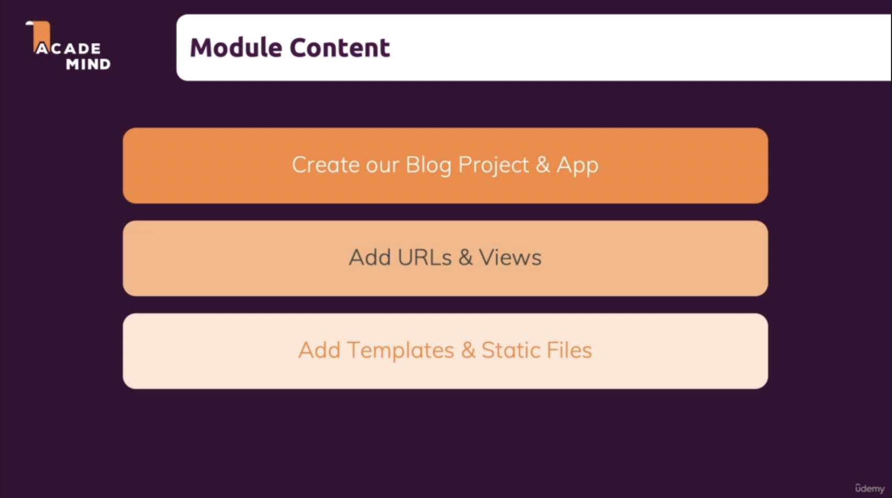
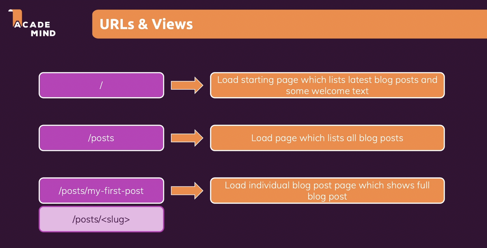

# Building a Blog Project - The Basics

This is a sample blog project and is all about strengthening the various Django concepts.

## Part 1 - Project, App, URLs, Views, Templates and Static Files

Since we are now aware about concept of creating projects & apps, adding URLs, views, templates and static files in Django, we can begin with the development of our blog project.

### Planning the Project

> Slug is simply a search-engine-friendly identifier. You could also have an id which is just a number and also an unique identifier but that would be less search-engine-friendly since it holds no information about the resource that's being searched and it's also less meaningful to users. That's why you typically use these slugs.
>
> This slug concept is so common that Django actually has a builtin path transformer for slugs. You learned about int and str transformers early in the course. There also is a slug transformer. It checks if the concrete value which is passed in here when this path is reached has this slug format which basically means it's a some text which consists only of characters and numbers and then may contain dashes but it doesn't contain any other special characters or anything like this. So it's basically a value which has this kind of format.

Readings:

[What is a URL Slug?](https://www.semrush.com/blog/what-is-a-url-slug/)