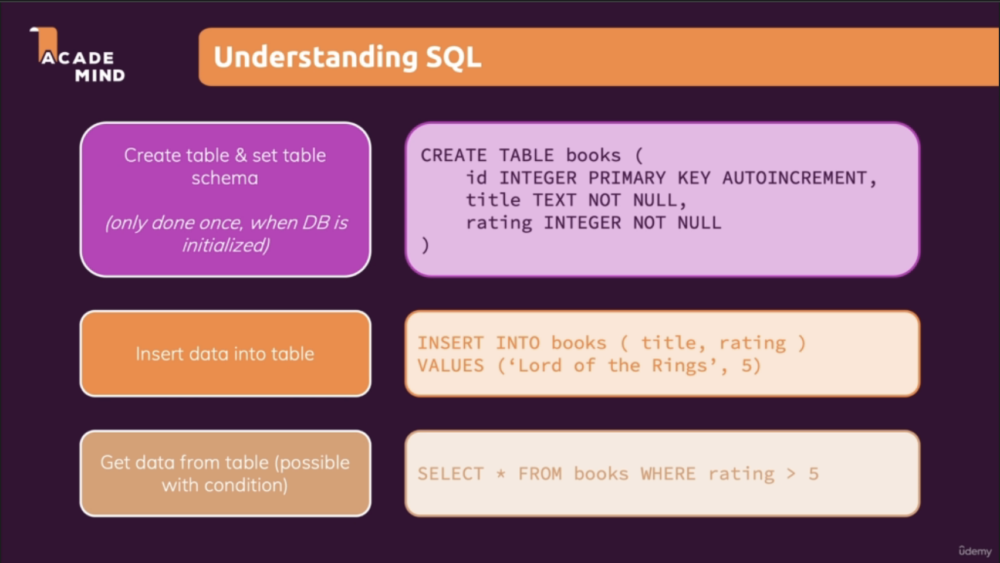

# Learn Django (for beginners)

## Introduction

Django is a Python-based web framework which allows you to quickly create web application without all of the installation or dependency problems that you normally will find with other frameworks. For more info, [click here](https://www.geeksforgeeks.org/django-basics/)

**Other useful readings**

- [MDN Web Docs](https://developer.mozilla.org/en-US/docs/Learn/Server-side/Django)
- [W3Schools](https://www.w3schools.com/django/index.php)
- [My Notes](other/Django.pdf)

### 1. Installing Django

You may create first virtual environment or install it globally. Use below command to install Django:

```
pip install Django
```

### 2. Creating a Django Project

Once Django is installed, you have to create a Django project. For that, use below command:

```
django-admin startproject <project_name>
```

*For example*

```
django-admin startproject myproject
```

It will create your **_myproject_** project which has below file structure

```
myproject
├── manage.py
└── myproject
    ├── __init__.py
    ├── asgi.py
    ├── settings.py
    ├── urls.py
    └── wsgi.py
```

### 3. Analyzing the created project

Please refer below links to understand the Django project structure

- [Techvidvan - Django Project Structure and File Structure](https://techvidvan.com/tutorials/django-project-structure-layout/)
- [AskPython - Python Django App Structure and Project Structure](https://www.askpython.com/django/django-app-structure-project-structure)

### 4. Starting the Development Server

Django comes with built-in web server that is used for development purposes.\
To start it, use below command:

```
python manage.py runserver
```

### 5. Django Apps

Django projects embrace a modular structure. A Django project often consists of multiple modules that make up the project. Now in Django world, those modules are not called modules rather they are termed as app and you then do store your actual application code in those apps.\
To create an app, ensure you are inside your project and then run below command:

```
python3 manage.py startapp <app_name>
```

*For Example*

```
python3 manage.py startapp myapp1
```

It will create **_myapp1_** inside your project and now you will have below file structure.\
You can find information about each Django app component in the links shared for understanding Django project above.

```
myproject
├── db.sqlite3
├── manage.py
├── myapp1
│   ├── __init__.py
│   ├── admin.py
│   ├── apps.py
│   ├── migrations
│   │   └── __init__.py
│   ├── models.py
│   ├── tests.py
│   └── views.py
└── myproject
    ├── __init__.py
    ├── asgi.py
    ├── settings.py
    ├── urls.py
    └── wsgi.py
```

## URLs and Views

### 1. URL


Readings:
- [Techvidvan - Django URLs and URL Mapping](https://techvidvan.com/tutorials/django-urls/)
- [Offical Django Docs - URL Dispatcher](https://docs.djangoproject.com/en/4.0/topics/http/urls/)

### 2. Views


Readings:
- [The Django Book - Mastering Django: Views](https://djangobook.com/django-tutorials/mastering-django-views/)

### [3. Monthly Challenges Project](01-URLs_and_Views/MyChallenges/)

In this project, below concepts were covered:
- Creating Views and URLs
- Dynamic Path Segments and Captured Values
- Path (Datatype) Converters
- Redirects
- Reverse Function and Named URLs

## Templates and Static Files

### 1. Adding, Registering & Rendering Templates

- After creating the apps, ensure to register or update your app name in the INSTALLED_APP list in settings.py
```
INSTALLED_APPS = [
    'django.contrib.admin',
    'django.contrib.auth',
    'django.contrib.contenttypes',
    'django.contrib.sessions',
    'django.contrib.messages',
    'django.contrib.staticfiles',
    'challenges',  # --> app name 'challenges' added
]
```
- By doing this, Django will look for all the app level templates in the directory 'templates/<app_name>'. These directories needs to be created for each apps.

```
challenges  # --> app created
├── migrations
│   ├── __init__.py
│   └── __pycache__
│       └── __init__.cpython-39.pyc
├── models.py
├── templates  # --> templates directory created
│   └── challenges
│       └── challenge_page.html
├── tests.py
├── urls.py
└── views.py
```

- Why are we creating <app_name>(challenges) directory inside 'templates' directory at app level?\
Let's say if you have a template exist in multiple apps with a same name then Django will not be able to tell them apart and merge all of them.
- If you have other templates outside your app, maybe some global templates used by multiple apps, then the path of these templates exists in some directory needs to be added in DIRS list in settings.py

```
TEMPLATES = [
    {
        'BACKEND': 'django.template.backends.django.DjangoTemplates',
        'DIRS': [],   # --> If you are creating a template folder at global level of your project then you have to mention the path of your template folder here.
        'APP_DIRS': True,
        'OPTIONS': {
            'context_processors': [
                'django.template.context_processors.debug',
                'django.template.context_processors.request',
                'django.contrib.auth.context_processors.auth',
                'django.contrib.messages.context_processors.messages',
            ],
        },
    },
]
```

- Please check the implementation about the template renders here, [views.py](02-Templates_and_Static_Files/MyChallenges/challenges/views.py) to know about rendering of templates.

### 2. Django Template Language


### 3. Filters

Readings:
- [GeeksforGeeks - Django Template Filters](https://www.geeksforgeeks.org/django-template-filters/#:~:text=Django%20Template%20Engine%20provides%20filters,it%20to%20one's%20own%20need.)
- [Official Docs - Built-in template tags and filters](https://docs.djangoproject.com/en/4.0/ref/templates/builtins/)

Why Filter?\
You want to limit the work you do in the view and really restrict it to your core business logic which might be needed for fetching and transforming the data and when it comes to formatting and outputting the data you might wanna do as much of that logic in the template and filters are a great tool for that.

### 4. Tags

Readings:
- [GeeksforGeeks - Django Template Tags](https://www.geeksforgeeks.org/django-template-tags/)

[for](https://docs.djangoproject.com/en/4.0/ref/templates/builtins/#for) and [url](https://docs.djangoproject.com/en/4.0/ref/templates/builtins/#url) tags usage can be seen here, [index.html](02-Templates_and_Static_Files/MyChallenges/challenges/templates/challenges/index.html) and for [if](https://docs.djangoproject.com/en/4.0/ref/templates/builtins/#if), refer [challenge_page.html](02-Templates_and_Static_Files/MyChallenges/challenges/templates/challenges/challenge_page.html)

### 5. Template Inheritance

- As a best practice, parent templates are created at project root level since other apps will inherit these and creating at app level doesn't make much sense.

- Create 'templates' directory at project root level and update its path in **settings.py** like below:

```
TEMPLATES = [
    {
        'BACKEND': 'django.template.backends.django.DjangoTemplates',
        'DIRS': [os.path.join(BASE_DIR, "templates")], # <--
        'APP_DIRS': True,
        'OPTIONS': {
            'context_processors': [
                'django.template.context_processors.debug',
                'django.template.context_processors.request',
                'django.contrib.auth.context_processors.auth',
                'django.contrib.messages.context_processors.messages',
            ],
        },
    },
]
```

Readings:
- [GeeksforGeeks - extends: Django Template Tags](https://www.geeksforgeeks.org/extends-django-template-tags/)

Check out the [parent template(base.html)](02-Templates_and_Static_Files/MyChallenges/templates/base.html) and how [index.html](02-Templates_and_Static_Files/MyChallenges/challenges/templates/challenges/index.html) & [challenge_page.html](02-Templates_and_Static_Files/MyChallenges/challenges/templates/challenges/challenge_page.html) are extending parent template.

### 6. Including Partial Template Snippets

When we have HTML snippets which needs to be used by some templates but not all the templates, in that case, we can make use of **_include_** tag.

An example could be navigation bar. In a big website, there might be few pages which may used same navigation bar.

This can be implement at app level. In our example, we will create a nav bar which will redirect us to the 'challenges' route. Implementation can be see here, [header.html](02-Templates_and_Static_Files/MyChallenges/challenges/templates/challenges/includes/header.html) and [challenge_page.html](02-Templates_and_Static_Files/MyChallenges/challenges/templates/challenges/challenge_page.html). A directory 'includes'(you can give any other name as well) is created inside 'templates' dir in challenges app and inside that _header.html_ is created.  

**Notes**
- The included snippets here will have access to the same variables you have access to in the template where you include them. For example, in challenge_page.html, we have variable 'month' that would also be available in that included template. But for index.html, this variable cannot be accessed.

- You can also pass in specific context, specific values for the included template. You do this with the **_with_** keyword and then you can set extra variables which will be available inside of the included snippet which are not available in the template which is including.

For example, let say, in challenge.html, if you do like below:

```


.
.
.
```
and let's say, your header.html is updated like below:

```
<header>
  <nav>
    <a href="">All Challenges</a>
  </nav>
</header>
{{ active_page }}
```
then along with this navbar, it will also render the value of 'active_page' variable.

### 7. More on Django Template Language (DTL)

<u>**Accessing Dictionary Fields in Templates**</u>

When accessing dictionary data in a template, you DON'T use this syntax:

```
{{ myDictionary['some_key'] }}
```

Instead, you use the dot notation - as if it were a regular Python object:

```
{{ myDictionary.some_key }}
```

This might look strange, but keep in mind, that the DTL is a custom-made language. It looks like Python, but ultimately it is NOT Python - it's a language parsed and executed by Django. Hence, its syntax can deviate - just as it does here.

<u>**Calling Functions in Templates**</u>

Calling functions in templates also works differently than it does in Python.
Instead of calling it, you use functions like regular variables or properties.
i.e., instead of:

```
{{ result_from_a_function() }}
```

you would use

```
{{ result_from_a_function }}
```

### 8. 404 Template

Check out the implementation at [views.py](02-Templates_and_Static_Files/MyChallenges/challenges/views.py)

In our example project, if user hit URL which does not exist, we will get below 404 and not the template created for it. In order to render our 404 template, we need to set ***DEBUG=False*** in _settings.py_, however, with that, Django development web server will not start. Our 404 page can be render when we deploy our application.


### 9. Adding Static Files

Readings:
- [Official Docs - How to manage static files (e.g. images, JavaScript, CSS)](https://docs.djangoproject.com/en/4.0/howto/static-files/)
- [LearnDjango - Django Static Files and Templates](https://learndjango.com/tutorials/django-static-files)
- [Digital Ocean - Working with Django Templates & Static Files](https://www.digitalocean.com/community/tutorials/working-with-django-templates-static-files)

Checkout implementation of static files at app level here, [index.html](02-Templates_and_Static_Files/MyChallenges/challenges/templates/challenges/index.html) (css file, [challenges.css](02-Templates_and_Static_Files/MyChallenges/challenges/static/challenges/challenges.css) is added at app level at path <app_name>/static/<app_name>/<css_file>)

Static file implementation at global level can be find here, [base.html](02-Templates_and_Static_Files/MyChallenges/templates/base.html). To let Django know about global level static files ensure defining a list of directories (**STATICFILES_DIRS**) in your settings ([settings.py](02-Templates_and_Static_Files/MyChallenges/MyChallenges/settings.py)) file where Django will also look for static files.

<u>**Building Static URLs Dynamically**</u>

Imagine, that you want to build a static URL where some part of the URL (e.g. the filename) is actually stored in a variable that's exposed to the template.
So you might want to build the URL like this:

```

```
Here, "the_file" would be a variable holding the actual filename.\
The above code would fail.

Instead, you can use the "add" filter provided by Django to construct this path dynamically:

```

```

### [10. Monthly Challenges Project](02-Templates_and_Static_Files/MyChallenges/)
Sample project from previous module added with all the topics discussed in this module.

## Data & Models

### 1. Introduction

Until now, we were storing our data either in file or assigning to some variables. However, data's persistent life is only till our servers are up and if servers are restarted, then all data would be vanished. Hence, we need database to store our data which is a more permanent solution.

Now to interact with databases, Django uses **models**.

### 2. Different Kinds of Data


### 3. Understanding Database options


>***Django has great built in support for a SQL, however, to use Django with NoSQL you will need to install extra packages.***

Readings:
- [SQL vs NoSQL](https://academind.com/tutorials/sql-vs-nosql)

### 4. Understanding SQL

When you creates a Django project, a [SQLite](https://www.sqlite.org/index.html) database is created with name **db.sqlite3**. If not, you can create a new file and simply name it db.sqlite3



Above are some examples of SQL queries which shows the creation of table and inserting data into it. However, with Django, we can altogether avoid writing queries by using Models.

### 5. Django Models

Django models are classes that represent a table or collection in our Database. It contains all the information regarding the table. These models are stored together in Django in a file **models.py** in our Django App.


Readings:
- [Official Docs](https://docs.djangoproject.com/en/4.1/topics/db/models/)
- [Django Models - Ask Python](https://www.askpython.com/django/django-models)
- [GeeksforGeeks](https://www.geeksforgeeks.org/django-models/)

### 6. Creating a Django Model with Fields

You will find the **models.py** in Django apps and that's where we define our models.

For example:

```
from django.db import models

class Book(models.Model):

    # Class attributes define schema
    title = models.CharField(max_length=50)
    rating = models.IntegerField()
```

Readings:
- [Django Model Fields - Official Docs](https://docs.djangoproject.com/en/4.1/ref/models/fields/)

### 7. Migrations

To make use of Django Model for creating table in database, we need to:

- First ensure our app is registered in **settings.py**.

- Secondly, database configurations are updated in **settings.py**.

- Now, in order to tell Django that it should reach out to the configured database, we will use the concept called [Migrations](https://docs.djangoproject.com/en/4.1/topics/migrations/#:~:text=Migrations%20are%20Django's%20way%20of,problems%20you%20might%20run%20into.)

- Migrations needs to be executed every time model is updated.

We will use the Model shown in previous example for creating table in database based on it. For that, we will first run ***makemigrations*** command:

```
python3 manage.py makemigrations

Migrations for 'book_outlet':
  book_outlet/migrations/0001_initial.py
    - Create model Book
```

***makemigrations*** basically generates the SQL commands for preinstalled apps (which can be viewed in installed apps in settings.py) and your newly created app's model which you add in installed apps. It does not execute those commands in your database file. So tables are not created after ***makemigrations***.

After applying ***makemigrations*** you can see those SQL commands with ***sqlmigrate*** which shows all the SQL commands which have been generated by ***makemigrations***.

```
python3 manage.py sqlmigrate book_outlet 0001

BEGIN;
--
-- Create model Book
--
CREATE TABLE "book_outlet_book" ("id" integer NOT NULL PRIMARY KEY AUTOINCREMENT, "title" varchar(50) NOT NULL, "rating" integer NOT NULL);
COMMIT;
```

Let's run ***migrate*** command.

```
python3 manage.py migrate

Operations to perform:
  Apply all migrations: admin, auth, book_outlet, contenttypes, sessions
Running migrations:
  Applying contenttypes.0001_initial... OK
  Applying auth.0001_initial... OK
  Applying admin.0001_initial... OK
  Applying admin.0002_logentry_remove_auto_add... OK
  Applying admin.0003_logentry_add_action_flag_choices... OK
  Applying contenttypes.0002_remove_content_type_name... OK
  Applying auth.0002_alter_permission_name_max_length... OK
  Applying auth.0003_alter_user_email_max_length... OK
  Applying auth.0004_alter_user_username_opts... OK
  Applying auth.0005_alter_user_last_login_null... OK
  Applying auth.0006_require_contenttypes_0002... OK
  Applying auth.0007_alter_validators_add_error_messages... OK
  Applying auth.0008_alter_user_username_max_length... OK
  Applying auth.0009_alter_user_last_name_max_length... OK
  Applying auth.0010_alter_group_name_max_length... OK
  Applying auth.0011_update_proxy_permissions... OK
  Applying auth.0012_alter_user_first_name_max_length... OK
  Applying book_outlet.0001_initial... OK
  Applying sessions.0001_initial... OK
```

You see above that other than initial migration, couple of other migrations are also applied. Reason being, this is the first time ***migrate*** command is executed and all these other migrations belongs to the other installed apps.

### 8. Inserting Data

Now that, tables are created in the database, we will try to insert some data in it.

We will first use Django shell to perform data insert operation and afterwards, we will see how same can be implemented with **views**.

- To open Django shell, type below command:

  ```
  python3 manage.py shell

  Python 3.9.1 (v3.9.1:1e5d33e9b9, Dec  7 2020, 12:10:52)
  [Clang 6.0 (clang-600.0.57)] on darwin
  Type "help", "copyright", "credits" or "license" for more information.
  (InteractiveConsole)
  >>>
  ```

  Interactive shell will get open.

- Import *Book* model class from app *book_outlet*. Object of *Book* class will denotes row in the DB table.

  ```
  >>> from book_outlet.models import Book
  >>>
  >>> harry_potter = Book(title="Harry Potter - Philospher's Stone", rating=5)
  >>>
  ```

- ***However, remember, by creating the object of model class will not create the entry in database.***

- To update the entry in database, we'll have to use **Model** class method called **save()** on Book class object which behind the scenes construct the SQL query and execute for us. Remember, **Book** class is inheriting **Model** class and **save()** method is defined in it.

  ```
  >>> from book_outlet.models import Book
  >>>
  >>> harry_potter = Book(title="Harry Potter - Philospher's Stone", rating=5)
  >>> harry_potter.save()
  >>> got = Book(title="Song of Ice and Fire", rating=5)
  >>> got.save()
  >>>
  ```

### 9. Getting all Entries

- To see the data saved by us, we can query database. For that, we have to use a **Model** class static attribute **objects**.

- Now, with the use of **objects** attribute with our own Model class, we get an object and on that, several methods can be used.

- [all()](https://docs.djangoproject.com/en/4.1/ref/models/querysets/#all) is one of them which gives all of the data stored in the database. 

  ```
  >>> from book_outlet.models import Book
  >>>
  >>> Book.objects.all()
  <QuerySet [<Book: Book object (1)>, <Book: Book object (2)>]>
  >>>
  ```

### 10. Updating Models and Migrations

In this section, we will see how the model class can be updated.

In our existing example, let's make 2 changes:

1. Define \_\_str\_\_ to print more user friendly instance name instead of default.
2. Add more fields.

First task can be achieved as below:

```
from django.db import models

# Create your models here.

class Book(models.Model):

    # Class attributes define schema
    title = models.CharField(max_length=50)
    rating = models.IntegerField()

    def __str__(self) -> str:
        return f"{self.title} ({self.rating})"
```

**Output**

```
>>> from book_outlet.models import Book
>>>
>>> Book.objects.all()
<QuerySet [<Book: Harry Potter - Philospher's Stone (5)>, <Book: Song of Ice and Fire (5)>]>
>>>
```
Remember, in this task, we didn't change the class structure and just added a new special method. This means, we don't have to run ***makemigrations*** and ***migrate*** commands.

Now, let's add few fields and thereby, begin with 2nd task.

- We will add validators in rating field to make sure min and max value will not less than 1 and more than 5 respectively.
- Add new fields, *author* and *is_bestselling*

```
from django.db import models
from django.core.validators import MinValueValidator, MaxValueValidator

# Create your models here.

class Book(models.Model):

    # Class attributes define schema
    title = models.CharField(max_length=50)
    rating = models.IntegerField(
        validators=[
            MinValueValidator(1),
            MaxValueValidator(5)
        ]
    )
    author = models.CharField(max_length=100)
    is_bestselling = models.BooleanField()

    def __str__(self) -> str:
        return f"{self.title} ({self.rating})"
```

Since, we have restructured our model class, therefore, to update the same in database, we need to run ***makemigrations*** and ***migrate*** commands. Let's do it.

```
python manage.py makemigrations

It is impossible to add a non-nullable field 'author' to book without specifying a default. This is because the database needs something to populate existing rows.
Please select a fix:
 1) Provide a one-off default now (will be set on all existing rows with a null value for this column)
 2) Quit and manually define a default value in models.py.
Select an option: 
```

Here, we are getting this prompt because we are trying to add a non-nullable field *author* to *Book* without a default value and we already have some data in our database which up to this point, before we run these migrations, only have *title* and *rating* fields. So, now Django is basically asking what do you want to do for those new columns which you're adding, because by default, they're not allowed to be empty (That's what non-nullable means).

Let's select option 2 and fix it at code level.

```
from django.db import models
from django.core.validators import MinValueValidator, MaxValueValidator

# Create your models here.

class Book(models.Model):

    # Class attributes define schema
    title = models.CharField(max_length=50)
    rating = models.IntegerField(
        validators=[
            MinValueValidator(1),
            MaxValueValidator(5)
        ]
    )
    author = models.CharField(null=True, max_length=100)
    is_bestselling = models.BooleanField(default=False)

    def __str__(self) -> str:
        return f"{self.title} ({self.rating})"
```

Setting **null=True** means that if there is no value provided to *author* field, **null** will be assigned.

Let's run again ***makemigrations*** and ***migrate*** commands.

```
python manage.py makemigrations
Migrations for 'book_outlet':
  book_outlet/migrations/0002_book_author_book_is_bestselling_alter_book_rating.py
    - Add field author to book
    - Add field is_bestselling to book
    - Alter field rating on book

python manage.py migrate       
Operations to perform:
  Apply all migrations: admin, auth, book_outlet, contenttypes, sessions
Running migrations:
  Applying book_outlet.0002_book_author_book_is_bestselling_alter_book_rating... OK
```

Let's check out those changes

```
>>> from book_outlet.models import Book
>>>
>>> Book.objects.all()
<QuerySet [<Book: Harry Potter - Philospher's Stone (5)>, <Book: Song of Ice and Fire (5)>]>
>>>
>>> Book.objects.all()[1].author
>>> Book.objects.all()[1].is_bestselling
False
>>>
>>> alchemist = Book(title="The Alchemist", rating=4, author="Paulo Coelho", is_bestselling=True)
>>> alchemist.save()
>>> Book.objects.all()[2].title
'The Alchemist'
>>>
>>> Book.objects.all()[2].author
'Paulo Coelho'
>>>
```

### 11. Blank vs Null


### 12. Updating Data

Let's carry on with our previous example and update the value of *author* and *is_bestselling* fields for initially created entries.

```
>>> from book_outlet.models import Book
>>>
>>> hp = Book.objects.all()[0]
>>> hp.author = "J.K. Rowling"
>>> hp.is_bestselling = True
>>> hp.save()
>>>
>>> Book.objects.all()[0].author
'J.K. Rowling'
>>>
>>> Book.objects.all()[0].is_bestselling
True
>>>
>>> got = Book.objects.all()[1]
>>> got.author = "George R.R. Martin"
>>> got.is_bestselling = True
>>> got.save()
>>>
>>> Book.objects.all()[1].author
'George R.R. Martin'
>>>
>>> Book.objects.all()[1].is_bestselling
True
>>>
```

Readings:
- [Bulk Update](https://docs.djangoproject.com/en/4.1/ref/models/querysets/#bulk-update)

### 13. Deleting Data

To delete the entry in database, we use **Model** class method **delete()**. See the usage below:

```
>>> from book_outlet.models import Book
>>>
>>> Book.objects.all()
<QuerySet [<Book: Harry Potter - Philospher's Stone (5)>, <Book: Song of Ice and Fire (5)>, <Book: The Alchemist (4)>]>
>>>
>>> alchemist = Book.objects.all()[2]
>>> alchemist.delete()
(1, {'book_outlet.Book': 1})
>>>
>>> Book.objects.all()
<QuerySet [<Book: Harry Potter - Philospher's Stone (5)>, <Book: Song of Ice and Fire (5)>]>
>>>
```

Readings:
- [Bulk Delete](https://docs.djangoproject.com/en/4.1/topics/db/queries/#deleting-objects)

### 14. 'create' instead of 'save'

Till now, we have seen that to create an entry in database, first object of model class is created and then **save()** method is used to save it in the database. However, with the usage of **create()** method, we can avoid the step of creating object altogether. See the usage below:

```
>>> from book_outlet.models import Book
>>>
>>> Book.objects.all()
<QuerySet [<Book: Harry Potter - Philospher's Stone (5)>, <Book: Song of Ice and Fire (5)>]>
>>>
>>> Book.objects.create(title="Half Girlfriend", rating=4, is_bestselling=False, author="Chetan Bhagat")
<Book: Half Girlfriend (4)>
>>>
>>> Book.objects.create(title="The Immortals of Meluha", rating=5, is_bestselling=True, author="Amish Tripathi")
<Book: The Immortals of Meluha (5)>
>>>
>>> Book.objects.all()
<QuerySet [<Book: Harry Potter - Philospher's Stone (5)>, <Book: Song of Ice and Fire (5)>, <Book: Half Girlfriend (4)>, <Book: The Immortals of Meluha (5)>]>
>>>
```

Readings:
- [Bulk Create](https://docs.djangoproject.com/en/4.1/ref/models/querysets/)

### 15. Querying and Filtering Data

- In our example, up to this point if we wanted to get a desired book, we always used **objects.all()** and then an index of our desired book. It definitely works but it could also fail if we try to find some book which does not exist.

- It is not ideal as every time we have to memorize the index.

- Instead of this, it would be nicer if we could simply get our desired book by telling Django for which field to filter or if we could get a list of books that fulfill a certain condition.

- To achieve that, we can use [get()](https://docs.djangoproject.com/en/dev/ref/models/querysets/#get) or [filter()](https://docs.djangoproject.com/en/dev/ref/models/querysets/#filter)

Let's see the usage of both:

<ins><strong>get()</strong></ins>

- Returns the object matching the given lookup parameters, which should be in the format described in [Field Lookups](https://docs.djangoproject.com/en/4.1/topics/db/queries/#field-lookups).

- It raises MultipleObjectsReturned if more than one object was found. The MultipleObjectsReturned exception is an attribute of the model class.

- It raises a DoesNotExist exception if an object wasn't found for the given parameters. This exception is also an attribute of the model class.

  ```
  >>> from book_outlet.models import Book
  >>>
  >>> Book.objects.get(id=1)
  <Book: Harry Potter - Philospher's Stone (5)>
  >>>
  >>> Book.objects.get(id=3)
  Traceback (most recent call last):
    File "<console>", line 1, in <module>
    File "/Users/aman/Documents/Git_Repos/learningDjango/.venv/lib/python3.9/site-packages/django/db/models/manager.py", line 85, in manager_method
      return getattr(self.get_queryset(), name)(*args, **kwargs)
    File "/Users/aman/Documents/Git_Repos/learningDjango/.venv/lib/python3.9/site-packages/django/db/models/query.py", line 496, in get
      raise self.model.DoesNotExist(
  book_outlet.models.Book.DoesNotExist: Book matching query does not exist.
  >>>
  >>> Book.objects.get(title="Half Girlfriend")
  <Book: Half Girlfriend (4)>
  >>>
  >>> Book.objects.get(is_bestselling=True)
  Traceback (most recent call last):
    File "<console>", line 1, in <module>
    File "/Users/aman/Documents/Git_Repos/learningDjango/.venv/lib/python3.9/site-packages/django/db/models/manager.py", line 85, in manager_method
      return getattr(self.get_queryset(), name)(*args, **kwargs)
    File "/Users/aman/Documents/Git_Repos/learningDjango/.venv/lib/python3.9/site-packages/django/db/models/query.py", line 499, in get
      raise self.model.MultipleObjectsReturned(
  book_outlet.models.Book.MultipleObjectsReturned: get() returned more than one Book -- it returned 3!
  ```

<ins><strong>filter()</strong></ins>

- Returns a new QuerySet containing objects that match the given lookup parameters.
- In methods like **filter, exclude, get**, etc, you cannot do comparing or other operations by using operators or you mostly do in Python. See example below where *rating<4* is used and a error was thrown.
- To do so, [Field Lookups](https://docs.djangoproject.com/en/4.1/topics/db/queries/#field-lookups) are used.
- Syntax for using field lookups is:

    ```
    field__lookuptype=value
    ```
- Find [here](https://docs.djangoproject.com/en/4.1/ref/models/querysets/#field-lookups) all different types of field lookups.

  ```
  >>> from book_outlet.models import Book
  >>>
  >>> Book.objects.filter(is_bestselling=True)
  <QuerySet [<Book: Harry Potter - Philospher's Stone (5)>, <Book: Song of Ice and Fire (5)>, <Book: The Immortals of Meluha (5)>]>
  >>>
  >>> Book.objects.filter(is_bestselling=True, rating=5)
  <QuerySet [<Book: Harry Potter - Philospher's Stone (5)>, <Book: Song of Ice and Fire (5)>, <Book: The Immortals of Meluha (5)>]>
  >>>
  >>> Book.objects.filter(rating<4)
  Traceback (most recent call last):
    File "<console>", line 1, in <module>
  NameError: name 'rating' is not defined
  >>>
  >>> Book.objects.filter(rating__gte=4, is_bestselling=False)
  <QuerySet [<Book: Half Girlfriend (4)>]>
  ```

> Basically use get() when you want to get a single unique object, and filter() when you want to get all objects that match your lookup parameters.

Readings:
- [Making Queries in Django - Official Docs](https://docs.djangoproject.com/en/4.1/topics/db/queries/)
- [get() vs filter()](https://stackoverflow.com/questions/3221938/difference-between-djangos-filter-and-get-methods)

### 16. "or" Conditions

- Up to this point, all those conditions we have written in previous section using **Field Lookups** are combined with **AND** operation, such as, if rating is greater than or equal to 4 and *is_bestselling* is False, give all such results.

- But what if I want to use combine these condition with **OR** operation. For that, Django provides ***Q*** class. See the usage of **Q** class below.

- In one of the example below, combination of **AND** and **OR** is used and condition separated with **AND** is comma-separated but enclosed in ***Q*** class. This is allowed. ***Remember, OR ones will be separated using **pipe(|)** and AND ones will separated using comma(,).***

- If you don't want to enclosed conditions with ***Q*** compared with **AND**, then, you have to write it at the very end. Refer example below.

  ```
  >>> from book_outlet.models import Book
  >>> from django.db.models import Q
  >>>
  >>> Book.objects.filter(Q(rating__lt=3) | Q(is_bestselling=True))
  <QuerySet [<Book: Harry Potter - Philospher's Stone (5)>, <Book: Song of Ice and Fire (5)>, <Book: The Immortals of Meluha (5)>]>
  >>>
  >>> Book.objects.filter(Q(rating__gt=4) | Q(is_bestselling=True))
  <QuerySet [<Book: Harry Potter - Philospher's Stone (5)>, <Book: Song of Ice and Fire (5)>, <Book: The Immortals of Meluha (5)>]>
  >>>
  >>> Book.objects.filter(Q(rating__gt=4) | Q(is_bestselling=True), Q(author="J.K. Rowling"))
  <QuerySet [<Book: Harry Potter - Philospher's Stone (5)>]>
  >>>
  >>> Book.objects.filter(Q(rating__gt=4) | Q(is_bestselling=True), author="J.K. Rowling")
  <QuerySet [<Book: Harry Potter - Philospher's Stone (5)>]>
  >>>
  >>> Book.objects.filter(author="J.K. Rowling", Q(rating__gt=4) | Q(is_bestselling=True))
    File "<console>", line 1
      Book.objects.filter(author="J.K. Rowling", Q(rating__gt=4) | Q(is_bestselling=True))
                                                                                        ^
  SyntaxError: positional argument follows keyword argument
  >>>
  ```

### 17. Query Performance

When you run queries, you learnt that certain operations instantly hit the database whilst others don't. Let's understand with examples.

- In below example, you might be thinking that the database is queried and results are stored in variable "bestsellers" as soon as enter was hit. ***Please note that this isn't the case. Instead, after hitting the enter, "bestsellers" var only consists of Query definition***

- Database will be queried when "bestsellers" var will be printed or used otherwise.

  ```
  >>> bestsellers = Book.objects.filter(is_bestselling=True)
  >>> print(bestsellers)
  ```

- This can be helpful to chain your query definition and query database in efficient way. In below example, "bestsellers" and "amazing_bestseller" var has query definition and "amazing_bestseller" var is using "bestsellers" to chain query. Now, Django has a elegant way to perform this. It notices that "amazing_bestseller" is based on "bestsellers" and it actually caches the results of your query sets. Hence, showing efficient of querying database.

  ```
  >>> bestsellers = Book.objects.filter(is_bestselling=True)
  >>> amazing_bestseller = bestsellers.filter(rating__gt=4)
  >>> print(bestsellers)
  <QuerySet [<Book: Harry Potter - Philospher's Stone (5)>, <Book: Song of Ice and Fire (5)>, <Book: The Immortals of Meluha (5)>]>
  >>>
  >>> print(amazing_bestseller)
  <QuerySet [<Book: Harry Potter - Philospher's Stone (5)>, <Book: Song of Ice and Fire (5)>, <Book: The Immortals of Meluha (5)>]>
  ```

- If you find yourself writing some code where you need the results from different query sets, you might wanna structure your code such that you allow Django to reuse cashed results.

- In other scenario, if you have something like shown in below example, then every single time, database will be queried and it is not efficient as Django is not caching it and eventually not able to reuse it.

  ```
  >>> print(Book.objects.filter(rating__gt=3))
  <QuerySet [<Book: Harry Potter - Philospher's Stone (5)>, <Book: Song of Ice and Fire (5)>, <Book: Half Girlfriend (4)>, <Book: The Immortals of Meluha (5)>]>
  >>>
  >>> print(Book.objects.filter(rating__gt=3))
  <QuerySet [<Book: Harry Potter - Philospher's Stone (5)>, <Book: Song of Ice and Fire (5)>, <Book: Half Girlfriend (4)>, <Book: The Immortals of Meluha (5)>]>
  >>>
  ```

### 18. Preparing Templates, Rendering Queried Data in the Templates, Rendering the Details page and Model URLs 

Now, we see how we can harness models and renders data in the templates from database via views.

Demonstrations includes:

- We will create a simple template where all books will be displayed.

- We will then make all book clickable to show more details.

- Please **base.html** will be created at app level in order to avoid writing more configurations.

Readings:
- [get_absolute_url()](https://docs.djangoproject.com/en/4.1/ref/models/instances/#get-absolute-url)
- [When to use Django get_absolute_url() method?](https://stackoverflow.com/questions/43179875/when-to-use-django-get-absolute-url-method)

### 19. Adding a SlugField & Overwriting save()

In this section, we will see the implementation of slug and necessities of overwriting **save()** method.

- In our example, when we click on a specific book, it is then redirecting us to that book details. To achieve it, **id** of that specific book is being used.

- However, when we see search engine point of view, it does not look nice.

- Let's see how to use slug here.

  - We don't necessarily need to replace our **id**, rather we can make use **SlugField** provided by Django which will store slugs specific to that book entry.

  - Now the next question is that how we generate slug for corresponding book automatically which follows some pattern, let's say, *song-of-ice-and-fire* which is based on our book title and separated by '-'.

  - To do that, we will first set the default value of **SlugField** as empty string and null as False. In that way, whenever a new book entry would be added, slug value will be an empty string and never a null.

  - But how can slug field be automatically updated for each newly added book?

  - To do that, we have to overwrite our **save()** method in a way that every time it is called to update database for some specific book entry, it will also save the slug field value for that book. Now to generate slugs, Django provide a method called **Slugify**. Check out below implementation.

  ```
  from django.db import models
  from django.core.validators import MinValueValidator, MaxValueValidator
  from django.utils.text import slugify

  class Book(models.Model):

    # Class attributes define schema
    title = models.CharField(max_length=50)
    rating = models.IntegerField(
        validators=[
            MinValueValidator(1),
            MaxValueValidator(5)
        ]
    )
    author = models.CharField(null=True, max_length=100)
    is_bestselling = models.BooleanField(default=False)
    slug = models.SlugField(default="", null=False)

    def save(self, *args, **kwargs):
      self.slug = slugify(self.title)
      super().save(*args, **kwargs)
  ```

  - ***For the entries exists before these changes, we need to update slugs manually by running save() method.***

- After making all above changes, our database needs to updated. Hence, we have to execute ***makemigrations*** and ***migrate*** command.

  ```
  python3 manage.py makemigrations
  Migrations for 'book_outlet':
    book_outlet/migrations/0003_book_slug.py
      - Add field slug to book

  python3 manage.py migrate
  Operations to perform:
    Apply all migrations: admin, auth, book_outlet, contenttypes, sessions
  Running migrations:
    Applying book_outlet.0003_book_slug... OK
  ```

- Let's also update the slug field for existing fields by called **save()** method.

  ```
  >>> from book_outlet.models import Book
  >>>
  >>> Book.objects.all()
  <QuerySet [<Book: Harry Potter - Philospher's Stone (5)>, <Book: Song of Ice and Fire (5)>, <Book: Half Girlfriend (4)>, <Book: The Immortals of Meluha (5)>]>
  >>> for i in Book.objects.all():
  ...     i.save()
  ...
  >>>
  >>> Book.objects.get(id=1).slug
  'harry-potter-philosphers-stone'
  >>>
  >>> Book.objects.get(id=2).slug
  'song-of-ice-and-fire'
  >>>
  >>> Book.objects.get(id=4).slug
  'half-girlfriend'
  >>>
  >>> Book.objects.get(id=5).slug
  'the-immortals-of-meluha'
  >>>
  ```

### 20. Using the Slug and Updating Field Options

To use slug to link book details, below updates are made:

[views.py](03-Data_and_Models/book_store/book_outlet/views.py)

```
def book_detail_slug(request, slug):
    book = get_object_or_404(Book, slug=slug)
    return render(request, 'book_outlet/book_details.html', {
        'title': book.title,
        'rating': book.rating,
        'author': book.author,
        'is_bestseller': book.is_bestselling,
    })
```

[index.html](03-Data_and_Models/book_store/book_outlet/templates/book_outlet/index.html)

Added an entry to demonstrate slugs

```
<li><a href="">{{ book.title }}</a> (Rating: {{ book.rating }}) - calling book detail page by using slugs</li>
```

[urls.py](03-Data_and_Models/book_store/book_outlet/urls.py)

Added this url which will execute slug based view.

```
path("<slug:slug>", views.book_detail_slug, name='book-detail-slug')
```

Consider that you are using slugs in your project and to ensure that whenever an user visits your site, find operation works quickly with slug. ***To do that, you make your slug field as 'database index'***. Just set **db_index** as **True** in your model class like below.

```
slug = models.SlugField(default="", null=False, db_index=True)
```

Database indexes are a technical detail of databases (SQL and NoSQL). It basically means that the database will save the values in that column a bit more efficiently or in a way that makes searching them a bit more efficient and that's some behind the scenes stuff which you don't need to know.

All you need to know is that creating such an index for a field can make searching that field quicker. So if you have a field which gets used a lot for finding data, like in our case, slug which we know to find books then we might wanna consider turning it into an index.

The ID field, which we get out of the box automatically has an index.

Now, you might think why don't we make every field an index if it speeds up the search performance, the problem is that creating an index on its own decreases performance because whenever you add a new entry to your database it needs to be added to the index, and if all your fields are indexes, that adds up. So having a few fields as indexes is no problem, but you definitely shouldn't turn all your fields into indexes really just the ones which you use a lot for querying.

Readings:
- [What is a Database Index?](https://www.codecademy.com/article/sql-indexes)

### 21. Aggregation and Ordering

<ins><strong>Aggregation</strong></ins>

Let's say on the index page we wanna show the total number of books which we have and also the average rating. How could we do that?

Well, thankfully, Django makes this very easy because it has something which is called aggregation methods. It has built-in methods which you can use on your models to aggregate results. See the usage below.

**views.py** - See how *tot_num_of_books* and *avg_rating* is used.

```
from django.db.models import Avg

def index(request):
    books = Book.objects.all()
    tot_num_of_books = books.count()
    avg_rating = books.aggregate(Avg("rating"))
    return render(request, 'book_outlet/index.html', {
        'books': books,
        'tot_num_of_books': tot_num_of_books,
        'avg_rating': avg_rating,
    })
```

**index.html** - Adding these 2

```
<hr>
<p>Total Number of Books - {{ tot_num_of_books }}</p>
<p>Average Ratings - {{ avg_rating }}</p>
```

If you run this, you will find *avg_rating* has the value *{rating__average}* which is a dictionary. This is because *aggregate* method can accept multiple functions and value of each those functions returned in a dictionary with syntax as <function_name>__<model_field_name>.

<ins><strong>Ordering</strong></ins>

Sorting is also a very simple with Django. For that, you can use [order_by()](https://docs.djangoproject.com/en/4.1/ref/models/querysets/#order-by). It allows you to order the results in the query set and it will do the ordering on the database level so that you need not to do it using Python. See the usage below.

```
def index(request):
    books = Book.objects.all().order_by('title')
```

By default, it sorts in ascending order. To sort in descending order, just add **"-"** before the field name.

```
def index(request):
    books = Book.objects.all().order_by('-title')
```

### Here's the [book_store](03-Data_and_Models/book_store/) project

## FAQs

**Q - Is Django a web server and a framework?**\
A - Yes and no. Django has a built-in web server that's used for development purposes. This web server is used when you run the web app locally, such as when debugging in Visual Studio. When you deploy to a web host, however, Django uses the host's web server instead. The wsgi.py module in the Django project takes care of hooking into the production servers.

## References
- [Python Django - The Practical Guide By Academind](https://www.udemy.com/course/python-django-the-practical-guide/)
